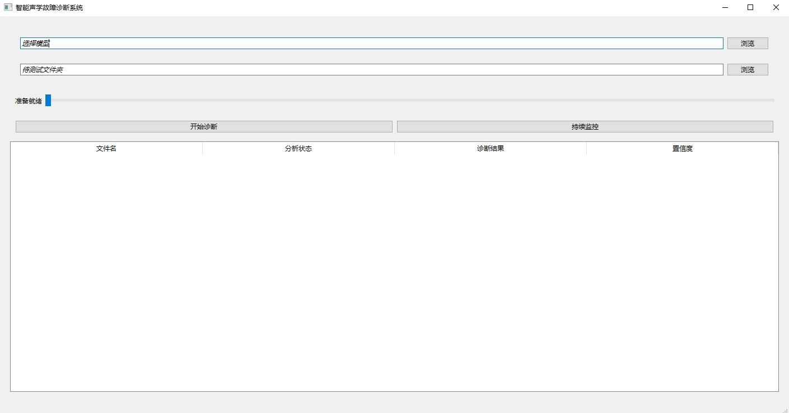

# Domain-generalization-based-causal-disentanglement-network-DGCDN
在“trained models”中下载.pth文件，将文件地址导入到loadCheckpointTest.py中，即可查看测试结果，所用数据集为MIMII DG和MIMII，可在此下载：https://zenodo.org/records/6529888 以及 https://zenodo.org/record/3384388 或者 https://drive.google.com/drive/folders/12vRaM_0_sjJB7n5w7ZAPZkEdrf1E23R4?usp=sharing (已经做好了预处理)。

本论文实验部分中对比方法的论文复现代码存放于：otherMethods

代码部分内容借鉴：https://github.com/ShaneSpace/DGFDBenchmark 。


Download the .pth file from the “trained models” and import the file path into loadCheckpointTest.py to view the test results. The dataset used are MIMII DG and MIMII, which can be downloaded here: https://zenodo.org/records/6529888 and https://zenodo.org/record/3384388 or https://drive.google.com/drive/folders/12vRaM_0_sjJB7n5w7ZAPZkEdrf1E23R4?usp=sharing (Preprocessing has been completed).

The reproduction codes for the comparative methods in the experimental section are stored in: otherMethods.

Some parts of the code are referenced from: https://github.com/ShaneSpace/DGFDBenchmark . 

# Citation
```
@article{wei2025dgcdn,
  title={DGCDN: robust acoustic fault diagnosis via domain-generalized causal disentanglement},
  author={Wei, Zhongliang and Zhai, Ruichen and Su, Chang},
  journal={Measurement Science and Technology},
  volume={36},
  number={12},
  pages={125006},
  year={2025},
  publisher={IOP Publishing}
}
```

# 界面设计
我们为DGCDN做了简单的界面Demo(使用Qt框架)，具体实现了如下功能：
1. 使用选择的预训练好的模型对选择的文件夹进行故障诊断
2. 使用选择的预训练好的模型对选择的文件夹进行持续监控
3. 对于诊断结果进行诊断结果展示，对于持续监控任务进行实时结果展示

具体内容详见 DGCDN产品需求说明书.docx

界面如图所示：

